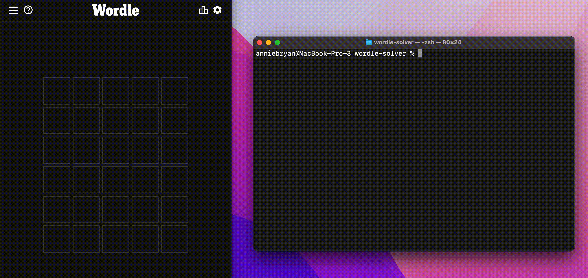

# Wordle Solver

## How do you play wordle?
 (Source: [NY Times](https://www.nytimes.com/games/wordle/index.html))

## How does this wordle solver work?

This wordle solver uses the information provided from each guess to narrow down the remaining list of 5-letter english words that could be the solution. From there, the wordle solver determines the most likely words (i.e. the best words to guess next). It does this using a combination of word frequencies (provided by `wordfreq`) and the expected number of words remaining if guessed (which wordle solver aims to minimize).

## How to use the command-line wordle solver

<ol>
  <li>Download the repo</li>

  ```
  git clone https://github.com/anniebryan/wordle-solver
  ```

  <li>Run the wordle solver</li>

  ```
  cd wordle-solver
  python3 wordle-solver.py
  ```

  <li>Open wordle, and guess a word.</li>

  <li>Type the word you guessed into the wordle solver, and press enter.</li>

  <li>Type the result that wordle gave you into the wordle solver, and press enter.</li>

  <ul>
    <li>Use b for ⬛ (the letter is not in the word)</li>
    <li>Use y for 🟨 (the letter is in the word but in the wrong spot)</li>
    <li>Use g for 🟩 (the letter is in the correct spot)</li>
  </ul>
</ol>

## Example

<b>🚨Warning: the video below contains spoilers for day 368 (June 22) </b>
